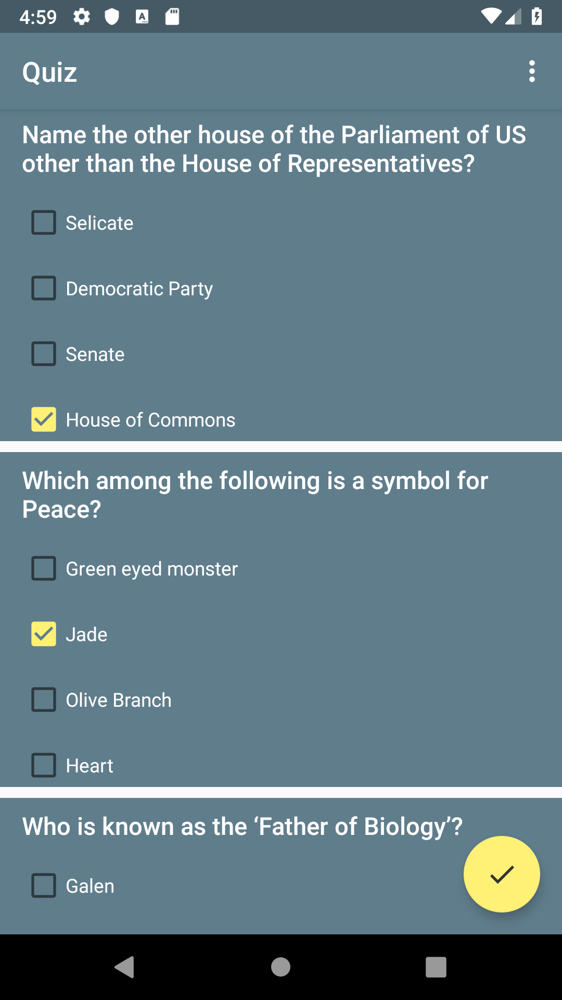
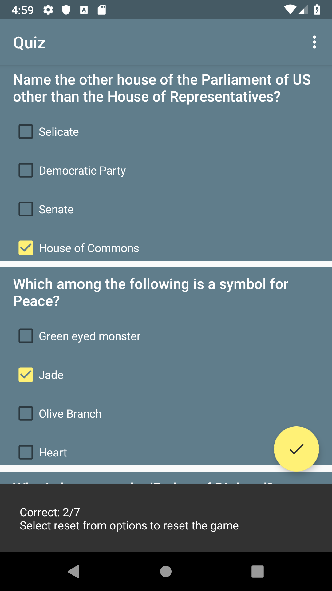
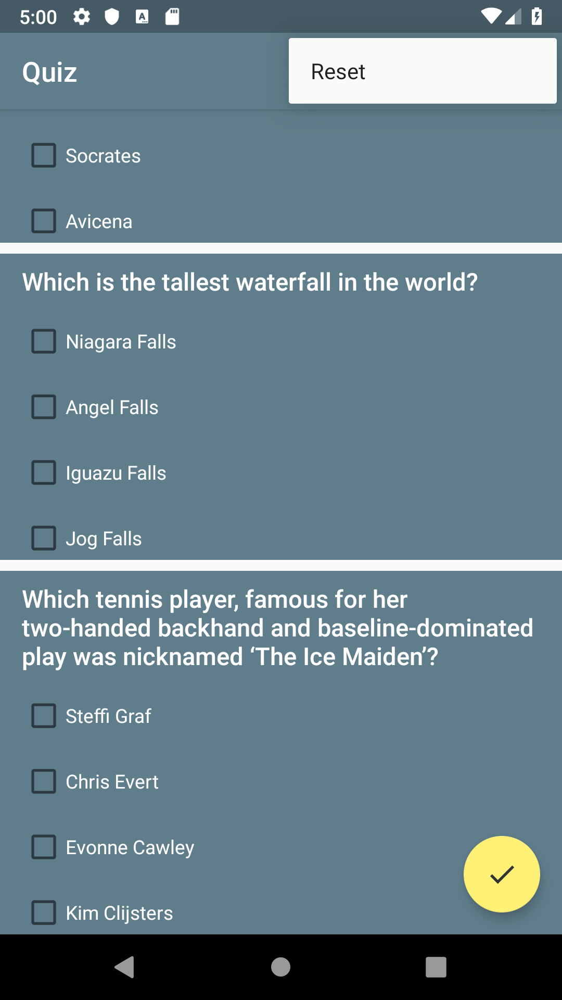

# Quiz
An android game that quizzes users on some questions

## Getting started
Import the project in Android Studio and compile it to an android device

### Prerequisites
  * Android Studio
  * Java SE Development Kit
  * Android device running on at least Android 4.1
  
## Screenshots
&nbsp; &nbsp; &nbsp; &nbsp; 

## Authors
  * Sijan Rijal - [sijanr](https://github.com/sijanr)
  
## License
This repository is licensed under [LICENSE](./LICENSE)
